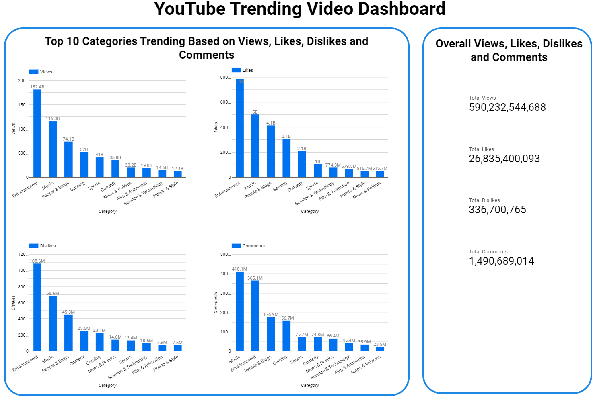
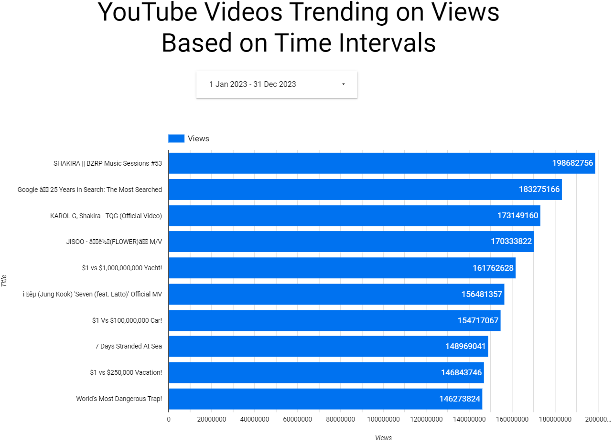

# Youtube Trending Video Dashboard
## Problem description
Dataset is YouTube Trending Video Dataset. It includes views, likes, dislikes etc columns for each video which is linked with title and video_id.
This dataset can be used for various analyses, such as understanding trends in video content, analyzing engagement metrics and check the trend between the time intervals.

## Workflow


For this project I decided to use the following tools:
- **Infrastructure as code (IaC):** Terraform
- **Workflow orchestration:** Airflow
- **Containerization:** Docker
- **Data Lake:** Google Cloud Storage (GCS)
- **Data Warehouse:** BigQuery
- **Transformations:** dbt 
- **Visualization:** Google Looker Studio

## Overview
1. Set up Infrastructure using Terraform for GCP
2. Data ingestion - Airflow to download the dataset and place it in a GCP bucket
3. Data warehouse - Host db tables on BigQuery, setup BQ using terraform
4. Transformations using dbt - Use dbt to transform the data to a suitable schema and store in BigQuery efficiently (partitioned and clustered)
5. Dashboard - Build a dashboard in Google Looker studio to visualize the results

## Pre-condition For Projects
- It is assumed that all tools from [data-engineering-zoomcamp](https://github.com/DataTalksClub/data-engineering-zoomcamp) has setup.
- Following instructions are given for project to run in windows.

## Project Description
### 1. Set up Infrastructure using Terraform for GCP
Terraform is used to create google cloud storage bucket and bigquery dataset using code.

Following steps has to be followed to set up GCP using Terraform.

* Open 1_terraform folder in Terminal\Git Bash
* Update Service Account JSON file path in default value for credentials variable in [variables.tf](1_terraform/variables.tf) file.
* Add your GCP Project ID to the commands below and run to create google cloud storage "dtc_data_lake_<Your Project ID>" bucket and bigquery dataset "YT_Trending_data_all"

    ```shell
    # Refresh service-account's auth-token for this session
    gcloud auth application-default login

    # Initialize state file (.tfstate) (navigate to the terraform directory first)
    terraform init
    ```

> [!NOTE]
> if "terraform init" command fails then run "terraform init -upgrade".

    ```shell
    # Check changes to new infra plan
    terraform plan -var="project=<your-gcp-project-id>"

    # Create new infra
    terraform apply -var="project=<your-gcp-project-id>"
    ```

* Delete infra after your work, to avoid costs on any running services

    ```shell
    terraform destroy
    ```

### 2. Data ingestion

The kaggle dataset [youtube-trending-video-dataset](https://www.kaggle.com/datasets/rsrishav/youtube-trending-video-dataset) is downloaded using kaggle api. Downloaded dataset is having multiple csv to merge all the csv data and create parquet file and insert into google cloud storage "dtc_data_lake_<Your Project ID>" bucket.

For more information please go through [YT_data_ingestion_dag.py](2_airflow\dags\YT_data_ingestion_dag.py).

Following steps has to be followed for data ingestion

* Update below variable in [docker-compose.yaml](2_airflow) file

    ```shell
    GCP_PROJECT_ID: 'xxxxx'
    GCP_GCS_BUCKET: 'dtc_data_lake_xxxxx'
    ```

* Place `google_credentials.json` file in `C:\Users\<user>\.google\credentials` path (<user> should be replaced with windows user) and update same path in `volumes` of `x-airflow-common` in [docker-compose.yaml](2_airflow) file as per below which is present in 84 line.

    ```shell
      - C:/Users/Bhumit/.google/credentials/:/.google/credentials:ro
    ```

* Login in https://www.kaggle.com and go to settings, Scroll to API section in Account

* Click Expire API Token to remove previous tokens. 

* Click on Create New API Token. It will download kaggle.json file and copy `kaggle.json` in [2_airflow](2_airflow) folder.

* Update kaggle_username and kaggle_key in args_dags dictionary of [YT_data_ingestion_dag.py](2_airflow\dags\YT_data_ingestion_dag.py) file respectively username and key from Kaggle API josn.

* Go to 2_airflow folder and run below command to set AIRFLOW_UID on Windows/Linux.

    ```shell
    mkdir -p ./dags ./logs ./plugins
    echo -e "AIRFLOW_UID=$(id -u)" > .env
    ```

* Build the image (only first-time, or when there's any change in the `Dockerfile`, takes ~15 mins for the first-time):
    ```shell
    docker-compose build
    ```
   
    or (for legacy versions)
   
    ```shell
    docker build .
    ```

* Initialize the Airflow scheduler, DB, and other config
    ```shell
    docker-compose up airflow-init
    ```

* Kick up the all the services from the container:
    ```shell
    docker-compose up
    ```

* In another terminal, run `docker-compose ps` to see which containers are up & running (there should be 7, matching with the services in your docker-compose file).

* Login to Airflow web UI on `localhost:8080` with default creds: `airflow/airflow`

* Run your DAG on the Web Console (It may take maximum 20 to 25 min as dataset is 2 GB).

* On finishing your run or to shut down the container/s:
    ```shell
    docker-compose down
    ```
### 3. Transformations using dbt

dbt (data build tool) is used for transformaton of YouTube raw data to dashboard ready data using SQLs.

Following steps has to be followed for dbt cloud tool:

* Login to dbt cloud

* To read/create bigquery table location should be updated as `asia-south1` (update location as per region Bigquery raw table is created) in connection after selecting bigquery.

* Copy [models](3_YT_dbt_models\models) folder content into dbt cloud `models` folder

* Remove all files and folders except `YT_Trending_Data` folder from `models` folder in dbt cloud

* copy models part from [dbt_project.yml](3_YT_dbt_models\dbt_project.yml) and paste in dbt cloud `dbt_project.yml` file.

* run `dbt run` command and bigquery tables are created as per below for dashboard.

- YT_Trending_Data.YT_data
- YT_Trending_Data.YT_data_by_category

### 4. Dashboard using Looker studio

Dashboard has been created using bigquery table and follwing questions are answered

1. Top 10 trending categories based on views, likes, dislikes, Comments ?



2. Top 10 videos trending based on views in 2023?



> [!NOTE]
> Following points to be keep in mind as dataset is updating every day.
> 1. If any columns are updated or removed project may fail.
> 2. Above snapshots might be not correct as everyday dataset is getting updated.
